# Hangman
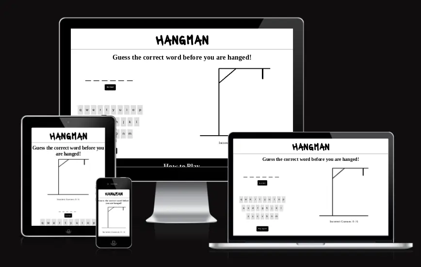
## Purpose
The purpose of this website is to provide an easy-to-use digital version of the traditional game of Hangman, available on-the-go and requiring no further players or materials.
### User Stories
As a player, I want to:
- [perform some task] so that I can [achieve some goal]".

[View the live deployed website here](https://aoifemcoleman.github.io/Hangman/)
## Features
### Existing Features

- __Favicon__

The website features a favicon with the initial "H" in the same font style and colour combination as the website's header. This favicon was selected so that it will be easily identifiable for players of the game.

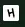

- __Header__

The header includes a heading with the website title "Hangman" in black against a white background. The font style used is "Lacquer" and is distinctive against the plain white background.

- _Desktop view_

- _Mobile view_

- __Game Area__

The game area contains all the essential elements of the traditional Hangman game, with a "skeleton" image of the gallows, that updates with body parts as players guess letters incorrectly, and a guess area with blank spaces relative to the amount of letters in the randomly generated word. It also contains a tally of incorrect guesses made, a virtual keyboard, a hint button and a reset button.

- _Desktop view_

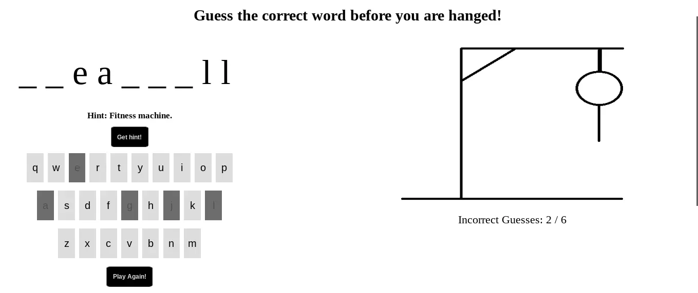

- _Mobile view_

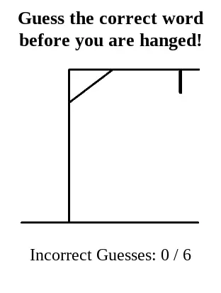

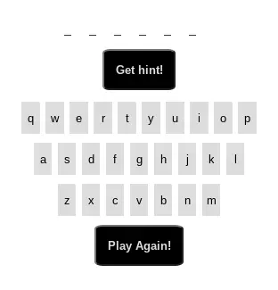

- __Updating gallows image__

Within the game area, when the player initially loads the page an image of empty gallows is visible. This image updates dynamically using Javascript functions as the player clicks on letters not available in the current randomly generated word, up to a maximum of 6 incorrect guesses. The image updates 6 times, from an empty gallows to a gallows with a head, up to a gallows with a head, body, left and right legs and left and right arms. The final image is of a complete hanged man. The player can therefore see as they progress closer and closer towards losing the game.

The image is updated using the function updateImage() within the script.js file, using a template literal to dynamically update the image from a series of hangman images with the assets images folder as users make incorrect guesses.

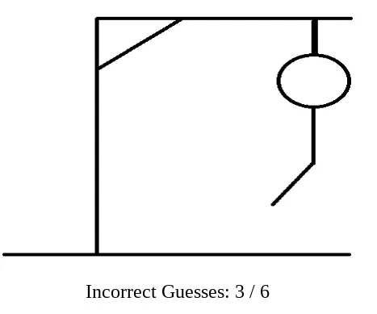

- __Incorrect Guesses Counter__

To ensure the player is fully aware of the amount of incorrect guesses made, and the limit of incorrect guesses that can be made before defeat, an incorrect guess counter also features on the web page, below the updating gallows image. 

The player sees that they have a maximum of 6 incorrect guesses, which correlates with the 6 body parts that update in the image. This counter is updated using the function updateGuessebox() within the script.js file.

- __Blank Letter Spaces__

Within the game area, is a guess area which features all the elements needed for players of the game to make their guesses. One of these elements is a list of blank letter spaces, relative to the number of missing letters in the randomly generated word. As the player clicks on letters available in the hidden word, the letters replace the blank spaces in their relevant position.

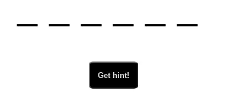

- __Virtual Keyboard__

Beneath the blank letter spaces, is a virtual keyboard. The virtual keyboard contains 26 letter keys, which players can click through as they make guesses to complete the hidden word. 

When a letter button has been clicked, the button cannot be reclicked, and changes colour to make it obvious to the player that the letter has already been guessed. This applies whether a letter was guessed correctly or incorrectly. These features are handled with an "on-click" attribute on each button within the index.html file, which executes the function letterClick() in the script.js file. This function changes the button's colour, disables the button and pushes the clicked letters into a usedLetters array, as well as updating the image and incorrect guesses counter.

- __Hint Feature__

The game area also includes a hint button beneath the blank letter spaces. This way, the player can choose whether or not to select to use a hint to guess the word. 

Once the button is clicked, a hint appears above it, to assist the player in guessing the correct word.

The words and hints are pulled through the chooseWord(wordList) function, from the wordList.js file which contains a list of random words and their corresponding hints. This feature is then implemented by using the style.css file to set the display for the hint to none, and toggling through the displayHint function within the script.js file.

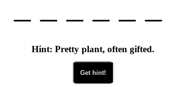

- __Win and lose alerts__

When a player correctly guesses all of the letters in a word, they will get an alert to say "Woohoo! You got it right!" This is implemented through the winner() function in the script.js file.

Likewise, when the player has reached the limit of incorrect guesses, they will receive an alert which states "You lost! :( The correct word was ___"

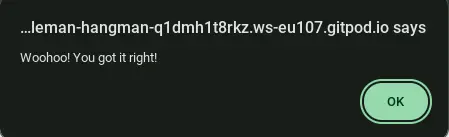

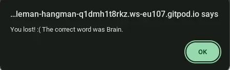

- __Reset button__

A reset button is featured beneath the keyboard, with the text "Play Again!" This button allows the player to reset the game at any time, and will issue a new word and corresponding hint to the player. It is implemented within the js.script file through the resetGame() function.

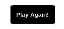

### Features left to implement

#### Word Categories
In future versions of the website, I would add libraries of different word categories for players to choose from, ie Animals, Food, Cities etc. This would allow a user to test their knowledge in different areas, and rely less on hints. 

#### Levels of difficulty

I would also add different libraries to pull from depending on varying levels of difficulty within a word category. That way, a player can choose to challenge themselves further.

#### Modals
I would incorporate modals when a player has either won or lost a game, rather than alerts in a future version of the website, to add visual aspects for the user experience. 

## Testing
### Accessibility
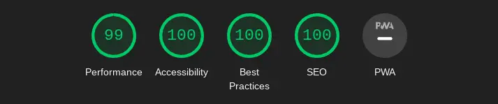
### Validator testing
#### HTML:
One issue was identified when passed through the official [W3C validator](https://validator.w3.org/).

The index.html had an empty heading which flagged a warning message. Although this was due to the text content being created dynamically by javascript, a placeholder was entered into the heading and when passed through the validator again, it returned no issues.

#### CSS: 

The style.css file was passed through the official [Jigsaw validator](https://jigsaw.w3.org/css-validator/validator) and returned no issues.

#### JS:

##### script.js:

Several issues were initially identified when the script.js file was passed through the official [Jshint validator](https://jshint.com/), which were due to it not being declared that the js file was operating with ES6. A comment was added to the js file to advise that esversion 6 is being used, which removed the majority of issues.

##### word-list.js:

The same issue relating to esversion 6 appeared when the word-list.js file was passed through the validator. As with the script.js file, a comment was added which resolved this issue. 

An issue also appeared showing wordList as being an unused variable. However, as this is due to the validator not having access to the related script.js file in unison, where this variable is used, no action was taken.

### Unfixed bugs
## Deployment
The site was deployed to GitHub using the following steps:

1. From the repository page, click on `Settings` in the navbar.
2. On the left side of the page, in the `Code and Automation` section, select `Pages`.
3. Under `Build and development`, the source should be set to `Deploy from a branch`.
4. Under `Branch` select `Main`, then `/root` and press `Save`.
5. Navigate back to the `<>Code` page in the navbar.
6. On the right side of the page, under `Deployments` you will see a link to `github-pages`, within which you can click on the expand icon to view the deployed website.

## Running the project locally

### How to clone the project

The site can be cloned from Github using the following steps:
1. Within the `hangman` respository on Github, click on the `Code` dropdown menu.
2. From `Local`, in the `HTTPS` section, copy the respository link.
3. Open IDE of choice.
4. Create a new terminal in your chosen directory, and enter 'git clone' followed by the copied respository link.
5. A clone of the respository will now be created within your directory.

## Credits

https://favicon.io/favicon-generator/ for Favicon
Microsoft Paint for Hangman drawings
Google fonts
https://members.optusnet.com.au/~charles57/Creative/Techniques/random_words.htm random word list