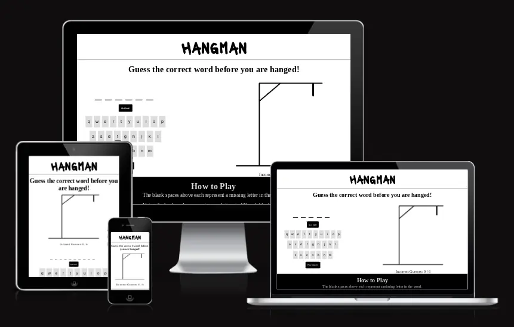

# Hangman

## Purpose
The purpose of this website is to provide an easy-to-use digital version of the traditional game of Hangman, available on-the-go and requiring no further players or materials.
### User Stories
As a player, I want to:
- [perform some task] so that I can [achieve some goal]".

[View the live deployed website here](https://aoifemcoleman.github.io/Hangman/)
## Features
### Existing Features

- __Favicon__

- __Header__

- _Desktop view_

- _Mobile view_

- __Game Area__

- _Desktop view_

- _Mobile view_

- __Updating gallows image__

- __Incorrect Guesses tally__

- __Blank letter spaces__

- __Virtual keyboard__

- __Hint feature__

- __Win and lose alerts__

- __Reset button__

### Features left to implement
## Testing
### Accessibility

### Validator testing
#### HTML:
One issue was identified when passed through the official [W3C validator](https://validator.w3.org/).

The index.html had an empty heading which flagged a warning message. Although this was due to the text content being created dynamically by javascript, a placeholder was entered into the heading and when passed through the validator again, it returned no issues.

#### CSS: 

The style.css file was passed through the official [Jigsaw validator](https://jigsaw.w3.org/css-validator/validator) and returned no issues.

#### JS:

##### script.js:

Several issues were initially identified when the script.js file was passed through the official [Jshint validator](https://jshint.com/), which were due to it not being declared that the js file was operating with ES6. A comment was added to the js file to advise that esversion 6 is being used, which removed the majority of issues.

##### word-list.js:

The same issue relating to esversion 6 appeared when the word-list.js file was passed through the validator. As with the script.js file, a comment was added which resolved this issue. 

An issue also appeared showing wordList as being an unused variable. However, as this is due to the validator not having access to the related script.js file in unison, where this variable is used, no action was taken.

### Unfixed bugs
## Deployment
The site was deployed to GitHub using the following steps:

1. From the repository page, click on `Settings` in the navbar.
2. On the left side of the page, in the `Code and Automation` section, select `Pages`.
3. Under `Build and development`, the source should be set to `Deploy from a branch`.
4. Under `Branch` select `Main`, then `/root` and press `Save`.
5. Navigate back to the `<>Code` page in the navbar.
6. On the right side of the page, under `Deployments` you will see a link to `github-pages`, within which you can click on the expand icon to view the deployed website.

## Running the project locally

### How to clone the project

The site can be cloned from Github using the following steps:
1. Within the `hangman` respository on Github, click on the 'Code' dropdown menu.
2. From 'Local', in the HTTPS section, copy the respository link.
3. Open IDE of choice.
4. Create a new terminal in your chosen directory, and enter 'git clone' followed by the copied respository link.
5. A clone of the respository will now be created within your directory.

## Credits

https://favicon.io/favicon-generator/ for Favicon
Microsoft Paint for Hangman drawings
Google fonts
https://members.optusnet.com.au/~charles57/Creative/Techniques/random_words.htm random word list