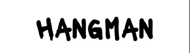
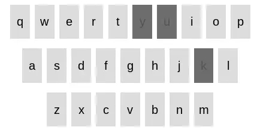

# Hangman

## Purpose
The purpose of this website is to provide an easy-to-use digital version of the traditional game of Hangman, available on-the-go and requiring no further players or materials.

This website is built using HTML, CSS and Javascript. 

I chose to recreate this game for my portfolio project as I have always enjoyed this fun but challenging game, and knew that it would be a great learning opportunity for Javascript! 

### User Stories
As a player, I want to:
- Test my vocabulary and guessing abilities through a fun and challenging game.
- Submit my guesses in an easy and comfortable manner, through the use of an on-screen keyboard which will update to disable letters buttons I have already clicked.
- View my progress as I make correct guesses so that I know the positions of each correctly guessed letter in the hidden word and can get closer to winning.
- See a hint if I need assistance to guess the correct word.
- Receive updates on how many chances/guesses I have left so that I can decide whether to click to get a hint or not.
- Be able to easily reset the game to play again, whether that is after winning or losing, or whether I would simply like a new random word to be generated.

[View the live deployed website here](https://aoifemcoleman.github.io/Hangman/)
## Features
### Existing Features

- __Favicon__

The website features a favicon with the initial "H" in the same font style and colour combination as the website's header. This favicon was selected so that it will be easily identifiable for players of the game.

- __Header__

The header includes a heading with the website title "Hangman" in black against a white background. The font style used is "Lacquer" and is distinctive against the plain white background.

- _Desktop view_

- _Mobile view_

- __Game Area__

The game area contains all the essential elements of the traditional Hangman game, with a "skeleton" image of the gallows, that updates with body parts as players guess letters incorrectly, and a guess area with blank spaces relative to the amount of letters in the randomly generated word. It also contains a tally of incorrect guesses made, a virtual keyboard, a hint button and a reset button.

- _Desktop view_

- _Mobile view_

- __Updating gallows image__

Within the game area, when the player initially loads the page an image of empty gallows is visible. This image updates dynamically using Javascript functions as the player clicks on letters not available in the current randomly generated word, up to a maximum of 6 incorrect guesses. The image updates 6 times, from an empty gallows to a gallows with a head, up to a gallows with a head, body, left and right legs and left and right arms. The final image is of a complete hanged man. The player can therefore see as they progress closer and closer towards losing the game.

The image is updated using the function updateImage() within the script.js file, using a template literal to dynamically update the image from a series of hangman images with the assets images folder as users make incorrect guesses.

- __Incorrect Guesses Counter__

To ensure the player is fully aware of the amount of incorrect guesses made, and the limit of incorrect guesses that can be made before defeat, an incorrect guess counter also features on the web page, below the updating gallows image. 

The player sees that they have a maximum of 6 incorrect guesses, which correlates with the 6 body parts that update in the image. This counter is updated using the function updateGuessebox() within the script.js file.

- __Blank Letter Spaces__

Within the game area, is a guess area which features all the elements needed for players of the game to make their guesses. One of these elements is a list of blank letter spaces, relative to the number of missing letters in the randomly generated word. As the player clicks on letters available in the hidden word, the letters replace the blank spaces in their relevant position.

- __Virtual Keyboard__

Beneath the blank letter spaces, is a virtual keyboard. The virtual keyboard contains 26 letter keys, which players can click through as they make guesses to complete the hidden word. 

When a letter button has been clicked, the button cannot be reclicked, and changes colour to make it obvious to the player that the letter has already been guessed. This applies whether a letter was guessed correctly or incorrectly. These features are handled with an "on-click" attribute on each button within the index.html file, which executes the function letterClick() in the script.js file. This function changes the button's colour, disables the button and pushes the clicked letters into a usedLetters array, as well as updating the image and incorrect guesses counter.

- __Hint Feature__

The game area also includes a hint button beneath the blank letter spaces. This way, the player can choose whether or not to select to use a hint to guess the word. 

Once the button is clicked, a hint appears above it, to assist the player in guessing the correct word.

The words and hints are pulled through the chooseWord(wordList) function, from the wordList.js file which contains a list of random words and their corresponding hints. This feature is then implemented by using the style.css file to set the display for the hint to none, and toggling through the displayHint function within the script.js file.

- __Win and lose alerts__

When a player correctly guesses all of the letters in a word, they will get an alert to say "Woohoo! You got it right!" This is implemented through the winner() function in the script.js file.

Likewise, when the player has reached the limit of incorrect guesses, they will receive an alert which states "You lost! :( The correct word was ___"

- __Reset button__

A reset button is featured beneath the keyboard, with the text "Play Again!" This button allows the player to reset the game at any time, and will issue a new word and corresponding hint to the player. It is implemented within the js.script file through the resetGame() function.

### Features left to implement

#### Word Categories
In future versions of the website, I would add libraries of different word categories for players to choose from, eg. Animals, Food, Cities etc. This would allow a user to test their knowledge in different areas, and possible reduce use of hints. 

#### Levels of difficulty

I would also add different libraries to pull from depending on varying levels of difficulty within a word category. That way, a player can choose to challenge themselves further.

#### Modals
I would incorporate modals when a player has either won or lost a game, rather than alerts in a future version of the website, to add visual aspects for the user experience. 

## Testing

### Responsivity

The website has been tested on multiple devices and browsers, including on Google Chrome, Firefox and Safari, as well as Android and macOS. It has been tested for responsivity using Chrome developer tools, which shows full responsivity.

### Feature testing

#### Word generation

The word generation was set up through the function chooseWord(wordList) and was tested through the use of console.log(currentWord) initially, and then later console.log(currentWordObject) when the word list was set up to pair words and hints. Through the use of the console.log() function I was able to view whether a random word had been generated or not.

#### Updating Hangman Image

The updating hangman image was implemented through the function updateImage(). I tested that the image was indeed loading with each incorrect letter click made by logging "Updating image..." to the console, and replicating losing myself in the browser. There was a bug with the imagePath, as the relative paths of `../images/Hangman${incorrectGuesses}.webp`, `./images/Hangman${incorrectGuesses}.webp` did not load the image. When the path was changed to `assets/images/Hangman${incorrectGuesses}.webp` however, the browser loaded the image. This was tested in the deployed website and there was no issue.

There was another bug which led the alert within the loser() function to appear before the final image of the Hangman. I corrected this through the use of a setTimeout handler to allow the final image time to update before the alert appears.

#### Letter Spaces

The creation of letter spaces was implemented through various functions. 

When the chooseWord function was tested and proven to be pulling a random word from the word List, the function wordLength(word) was created to return the length of the currentWord. This was tested to be correlating correctly, again through the use of console.log(`${currentWordLength}`) and ensuring the number returned was the same as the amount of letters in the corresponding word. This would determine the amount of letter spaces created.

The next function needed to create this feature was createLetterSpaces(length). This function was tested through a combination of viewing the currentWord and currentWordLength variables in the console and manual comparison of the amount of "blank spaces" created on the browser, and confirming that they aligned.

#### Virtual Keyboard

This element was statically created through HTML and CSS, and an on-click attribute was invoked through Javascript through a variety of functions and methods, namely the letterClick and checkWord(letter) functions. 

The letterClick(button, clickedLetter) function was initially tested through replication of clicking the buttons and noting that their background colour updated when they had been clicked. Later a disable button method was added to further confirm a player could no longer re-click the same button. 

The checkWord(letter) function iterates through the currentWord array to check if it contains the letter in question, and then replaces the corresponding blank space in the array with the letter. This was again tested to be functioning as intended through the console messages and ensuring the generated word listed there and the replaced blank space were in agreement.

An empty array for usedLetters was declared, for all clicked letters to be pushed to. This was tested to be working later in the winner() function.

#### Hint button

The hint button was set up through the function displayHint(), as well as creating new currentWord variables to include currentWordObject and currentHint. These variables were tested through the use of console.log() and manual tests of the button and appearing hints, to confirm the words and corresponding hints in the console were in alignment and that this also reflected in the browser. 

#### Reset button

The reset button was tested by viewing and replicating the changes appearing in the browser when clicked, and ensuring all elements had reset to their original state. Initially the keyboard buttons did not revert to their original colour, so a loop was created within the resetGame() function to iterate through each button and change their colour back to the original light grey.

#### Incorrect Guess Box - Incrementation

This feature was applied using the incorrectLetters array and tested through replication, ensuring that the tally updated along with the hangman image.

### Accessibility

The website contains alt text, aria-labels and contrasting colours for screen reader use, and received a score of 100% using Lighthouse in Chrome Developer Tools.

### Validator testing
#### HTML:
One issue was identified when passed through the official [W3C validator](https://validator.w3.org/).

The index.html had an empty heading which flagged a warning message. Although this was due to the text content being created dynamically by javascript, a placeholder was entered into the heading and when passed through the validator again, it returned no issues.

#### CSS: 

The style.css file was passed through the official [Jigsaw validator](https://jigsaw.w3.org/css-validator/validator) and returned no issues.

#### JS:

##### script.js:

Several issues were initially identified when the script.js file was passed through the official [Jshint validator](https://jshint.com/), which were due to it not being declared that the js file was operating with ES6. A comment was added to the js file to advise that esversion 6 is being used, which removed the gross majority of issues.

The validator showed that there was one undefined variable and one unused variable. The undefined variable was `wordList` and this was flagged due to the validator not having access to the wordList.js file simultaneously, and therefore not recognising it as a variable.
The unused variable was identified as `letterClick`. This is due to the fact that this function is not being invoked within the script.js file, however as it is being invoked through the `on-click` attribute with the keyboard buttons in the index.html file, no further actions needed to be taken.

The following metrics were also returned:

- There are 16 functions in this file.
- Function with the largest signature take 2 arguments, while the median is 0.5.
- Largest function has 17 statements in it, while the median is 2.5.
- The most complex function has a cyclomatic complexity value of 4 while the median is 1.

##### word-list.js:

The same issue relating to esversion 6 appeared when the word-list.js file was passed through the validator. As with the script.js file, a comment was added which resolved this issue. 

An issue also appeared showing wordList as being an unused variable. However, as this is due to the validator not having access to the related script.js file in unison, where this variable is used, no action was taken.

### Unfixed bugs
## Deployment
The site was deployed to GitHub using the following steps:

1. From the repository page, click on `Settings` in the navbar.
2. On the left side of the page, in the `Code and Automation` section, select `Pages`.
3. Under `Build and development`, the source should be set to `Deploy from a branch`.
4. Under `Branch` select `Main`, then `/root` and press `Save`.
5. Navigate back to the `<>Code` page in the navbar.
6. On the right side of the page, under `Deployments` you will see a link to `github-pages`, within which you can click on the expand icon to view the deployed website.

## Running the project locally

### How to clone the project

The site can be cloned from Github using the following steps:
1. Within the `hangman` respository on Github, click on the `Code` dropdown menu.
2. From `Local`, in the `HTTPS` section, copy the respository link.
3. Open IDE of choice.
4. Create a new terminal in your chosen directory, and enter 'git clone' followed by the copied respository link.
5. A clone of the respository will now be created within your directory.

## Credits

### Content
- The words in the wordList in word-list.js were taken from [here](https://members.optusnet.com.au/~charles57/Creative/Techniques/random_words.htm) and modified.
- Idea for using a wordList with words and hints to separate concerns came from [here](https://www.codingnepalweb.com/build-hangman-game-html-javascript/), as well as inspiration for creating an on-screen keyboard
- Idea for including instructions section found [here](https://thewordsearch.com/hangman/).
- I imported my fonts from [Google Fonts](https://fonts.google.com/).

### Media
- The Favicon was created using this [favicon generator](https://favicon.io/favicon-generator/).
- The hangman image was created using the Microsoft Paint programme.

### Code
- Idea for setting up "gameOver = false" flag found on [Stack Overflow](https://stackoverflow.com/questions/33722268/disabling-click-counter-function-after-timer-runs-down-to-zero-and-alerts-game).
- Idea and code for disabling keyboard buttons taken from [here](https://www.codingnepalweb.com/build-hangman-game-html-javascript/).
- Learned how to set strings to lower or upper case on [W3 Schools](https://www.w3schools.com/jsref/jsref_tolowercase.asp).
- Learned about every() method for use in winner function [here](https://developer.mozilla.org/en-US/docs/Web/JavaScript/Reference/Global_Objects/Array/every).
- Idea for setting a variable of maxIncorrectGuesses taken from [here](https://www.codingnepalweb.com/build-hangman-game-html-javascript/) and modified.
- Idea for using setTimeout to delay alert to allow final hangman image update to appear found [here](https://forum.freecodecamp.org/t/how-to-make-js-wait-until-dom-is-updated/122067) and modified.
- Learned about using querySelector() on [mdn web docs](https://developer.mozilla.org/en-US/docs/Web/API/Document/querySelector).
- Code for creation of virtual keyboard taken from this [Youtube tutorial](https://www.youtube.com/watch?v=K7I0SJ86NvE) and modified.

## Acknowledgements

I would like to sincerely thank my mentor, Ronan McClelland for his support, consistent great ideas as well as patience while guiding me through my project. 

I would also like to thank Code Institute tutor support for helping me identify bugs in seconds, that I had been looking at for hours! And for their constant patience and helpful attitudes.